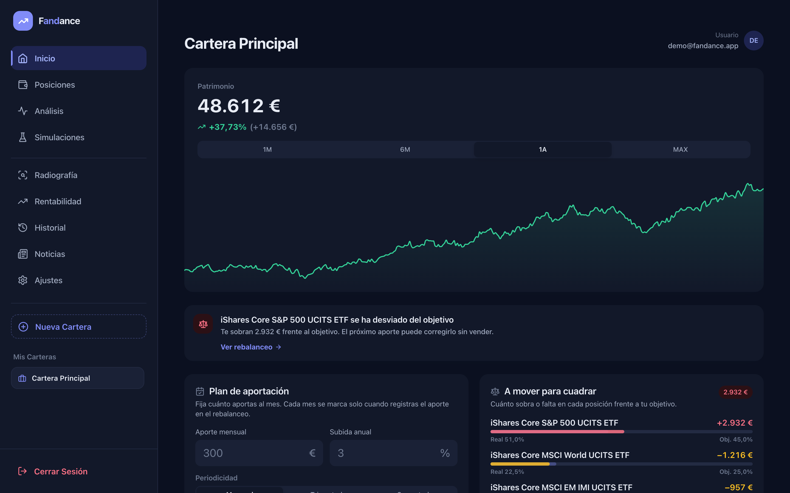
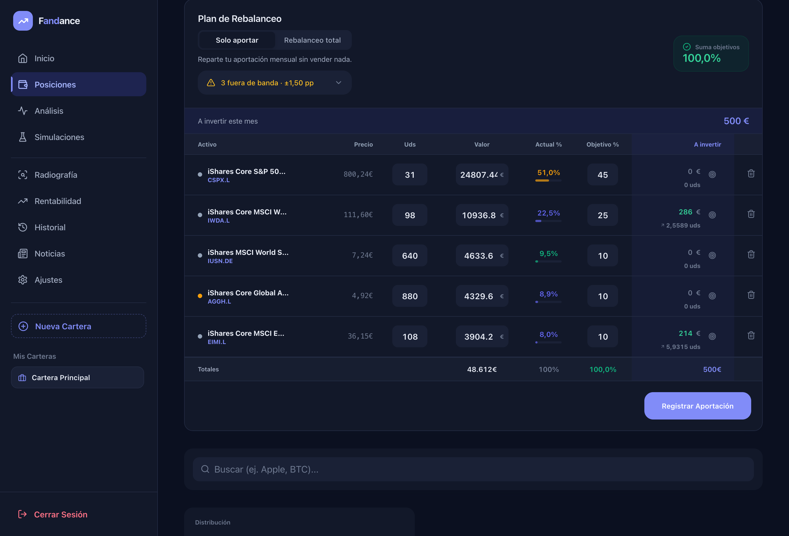
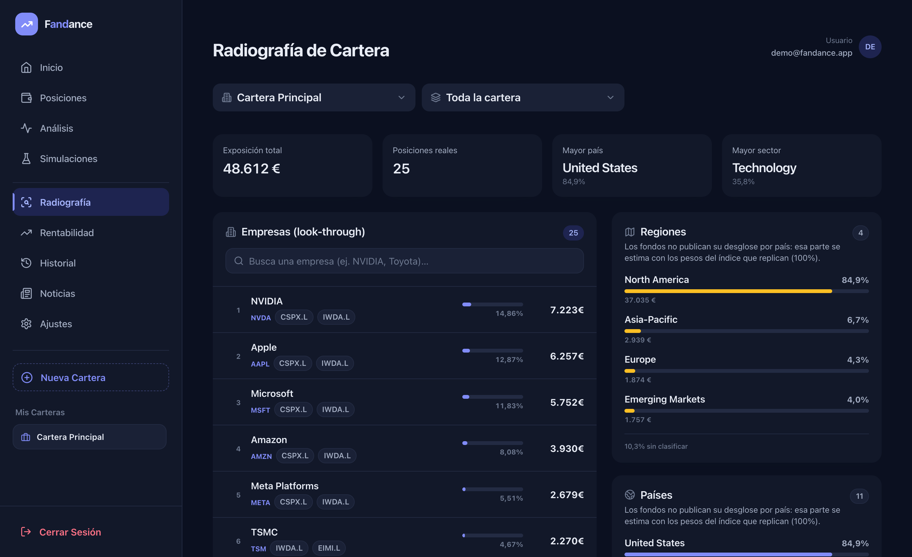
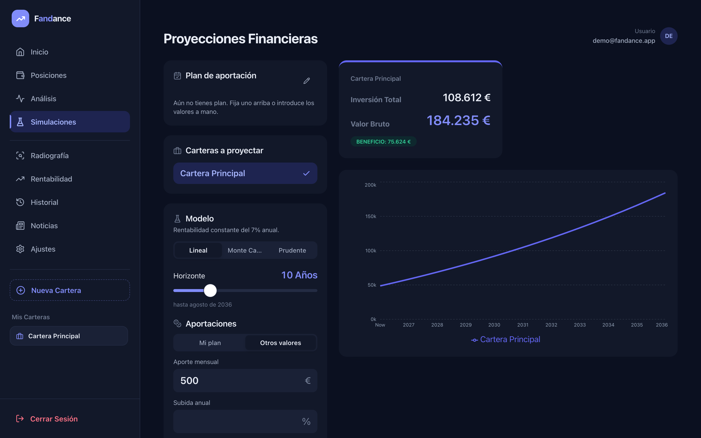

<h1 align="center">Fandance</h1>

<p align="center">
  <strong>An index-portfolio rebalancer that tells you exactly where your next contribution should go.</strong>
</p>

<p align="center">
  <a href="https://fandance-pwa.vercel.app"></a>
  
  
  
  
</p>

<p align="center">
  
</p>

<p align="center">
  <sub>Every screenshot on this page is generated from synthetic data by <a href="scripts/demo"><code>scripts/demo</code></a> — no real holdings are shown. The interface ships in English and Spanish.</sub>
</p>

---

## Why this exists

Passive investing is simple in theory and tedious in practice. Every month you
have to work out how much of your contribution goes to each fund so the
portfolio drifts back toward its target allocation — without selling, because
selling triggers tax and fees.

Robo-advisors solve this internally and charge a management fee for it. Fandance
implements the same **cash-flow rebalancing** methodology and hands the answer
back to you: *"put €46 into the US fund, €58 into Europe, €24 into emerging
markets."* You place the orders in your own broker.

> **Disclaimer:** this is a personal money-management tool, not investment
> advice. You execute every trade yourself.

---

## What it does

### Rebalancing engine
Two modes, both driven by target weights you define:

| Mode | Behaviour |
|------|-----------|
| **Contribute only** *(default)* | Distributes the monthly contribution across the assets furthest **below** target. Never sells, and always allocates the full amount — the remainder is spread by target weight once every gap is closed. |
| **Full rebalance** | Also computes sell orders, landing exactly on the target allocation. |

Target weights are editable inline or from a dedicated allocation editor with a
live "sum = 100%" check, equal-split and normalise helpers.

<p align="center">
  
</p>

<p align="center">
  <sub>The <strong>A invertir</strong> column is the answer: how much of this month's contribution goes to each fund. Assets already at or above target get nothing, and the drift chip flags how many sit outside the tolerance band.</sub>
</p>

### Portfolio X-ray (ETF look-through)
Funds hide what you actually own. The X-ray resolves each ETF into its
underlying holdings and aggregates them across the whole portfolio, so a company
held inside several funds is **summed into a single real exposure**:

- **Companies** — e.g. NVIDIA held through both a US and an emerging-markets ETF appears once, with the total € and % and a chip per source fund.
- **Countries / regions**, **currencies** and **sectors**, each as a ranked breakdown.
- Filter the whole portfolio or drill into a single ETF.

Holdings and sector weights come from `yfinance`; country and currency are
inferred from the exchange suffix of each underlying ticker (`2330.TW` →
Taiwan / TWD).

<p align="center">
  
</p>

<p align="center">
  <sub>NVIDIA is held through both the S&amp;P 500 and the MSCI World fund; the X-ray adds the two into one real position and shows which funds it came from. Same for regions, countries, currencies and sectors.</sub>
</p>

### Performance & benchmarking
- **Money-weighted return (IRR/XIRR)** computed from real contribution dates, not a naive percentage.
- **Benchmark comparison** against S&P 500, MSCI World, Nasdaq 100, Euro Stoxx 50, emerging markets, gold, bitcoin and US bonds — base-100 overlay plus return, CAGR, annualised volatility, max drawdown, **beta** and **correlation**.
- **Net total** breakdown with fees and taxes.

### Trade Republic import
Drag in the broker's CSV export and Fandance derives your real history:
invested capital, realised P/L, dividends, interest, fees and taxes, IRR, and
the date of your **first purchase**, so every statistic runs from the day you
actually started investing. Parsing happens entirely in the browser — the file
is never uploaded.

### Staying in sync with your broker
Fandance prices holdings with live market data, exactly as your broker does.
As long as the **unit count** matches, the valuation tracks your broker
automatically — no paid data feed, no credential sharing. Units are synced
monthly via the CSV import or edited directly.

### Also included
- Installable **PWA** with offline caching; mobile layout with bottom navigation.
- Multiple portfolios, operation history with undo, projections (deterministic and Monte Carlo), market news with an RSI sentiment indicator.

<p align="center">
  
</p>
- English / Spanish, light / dark.
- New accounts are seeded with three example portfolios (20 / 50 / 80 % risk) spanning ETFs, equities, bonds, gold and crypto.

---

## Architecture

```
Fandance-PWA/
├─ frontend_rebalanceo/        React 18 · Vite · Tailwind · Framer Motion · Recharts
│  └─ src/
│     ├─ api.js                axios client; injects the Supabase JWT on every call
│     ├─ utils.js              rebalancing engine, XIRR, X-ray aggregation
│     ├─ components/           Dashboard, X-ray, benchmark, CSV importers, UI kit
│     └─ pages/                Performance, Analysis, Settings, X-ray
├─ api/index.py                FastAPI on Vercel Python Functions
└─ vercel.json                 build + routing for a single Vercel project
```

**Data flow.** The browser authenticates against Supabase and calls
`/api/*` with the resulting JWT. The backend derives the user from that token,
enforces ownership on every row, fetches market data from `yfinance`, and reads
and writes Postgres through Supabase.

The rebalancing maths lives client-side in `utils.js` (`buildRebalancePlan`,
`xirr`, `buildXray`) — pure functions, easy to read and to reason about.

---

## Security

- **Authentication required on every endpoint.** Requests carry a Supabase JWT; the API verifies it and derives the user id server-side. No `user_id` is ever accepted from the client.
- **Ownership checks** on every resource before read or write.
- **Per-user rate limiting** across the API.
- **No secrets in the bundle.** The `service_role` key lives only in server-side environment variables; the frontend only ever sees the anon key.
- Imported CSVs and cost-basis data are parsed and stored locally, never uploaded.

See [`SECURITY.md`](SECURITY.md) for the full baseline.

---

## Running locally

**Prerequisites:** Node.js 24, Python 3.10+, a Supabase project (free tier is enough).

```bash
# Frontend
cd frontend_rebalanceo
npm install
npm run dev                     # http://localhost:5173

# Backend (second terminal)
cd api
pip install -r requirements.txt
uvicorn index:app --reload --port 8000
```

Environment variables — use placeholders, never commit real keys:

| Variable | Scope | Notes |
|----------|-------|-------|
| `VITE_API_URL` | frontend | `/api` in production, `http://localhost:8000/api` locally |
| `VITE_SUPABASE_URL` | frontend | project URL |
| `VITE_SUPABASE_ANON_KEY` | frontend | **anon** key only |
| `VITE_ADMIN_EMAIL` | frontend | optional: account that receives the default target allocation |
| `SUPABASE_URL` | backend | project URL |
| `SUPABASE_KEY` | backend | **service_role** key, server-side only |
| `ALLOWED_ORIGINS` | backend | comma-separated origins allowed by CORS. Defaults to localhost, so production needs the real domain |

Tables: `portfolios`, `portfolio_items`, `assets`, `rebalance_history`,
`rebalance_history_items`.

---

## Regenerating the screenshots

The images in this README are produced from synthetic data, so they can be
refreshed after a redesign without touching a real account:

```bash
cd frontend_rebalanceo && npm run build -- --mode demo && cd ..
python scripts/demo/servidor.py &     # serves dist/ plus stubbed /api/*
python scripts/demo/capturar.py       # headless Chrome -> docs/screenshots/
```

`servidor.py` answers every endpoint the screens need with a fixed, invented
portfolio; `capturar.py` drives a headless Chrome, seeds a fake session so the
login is skipped, and writes one PNG per screen at 2x.

---

## Deployment

`vercel.json` wires the whole repository into one Vercel project: it builds the
SPA, serves the FastAPI app under `/api/*` and rewrites client-side routes.
Pushing to `main` deploys to production.

---

## Cost

Free, and designed to stay that way: Vercel Hobby, the Supabase free tier and
`yfinance` for market data. No paid API, no subscription.

---

## Licence

Released under the MIT Licence.
